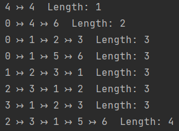

# Finding The Prime Paths Coverage

## Introduction

According to Prime path coverage criterion, this program will generate all the prime paths of graph whose structure is exactly defined by given text file.

>  NOTE: This repository contains a program with six different languages: Dart-Flutter, Java, Kotlin, Python, PHP, JavaScript.

> ⚠ WARNING: The program with Java language contains bugs that have not been fixed.
## Define a Graph

The structure of the graph must be exactly defined. For example, as the structure shown in the below picture:

## Output:

